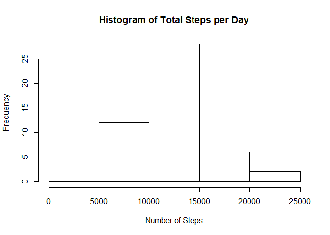
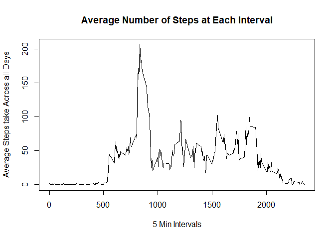
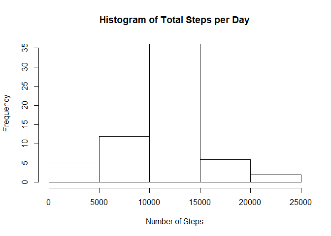
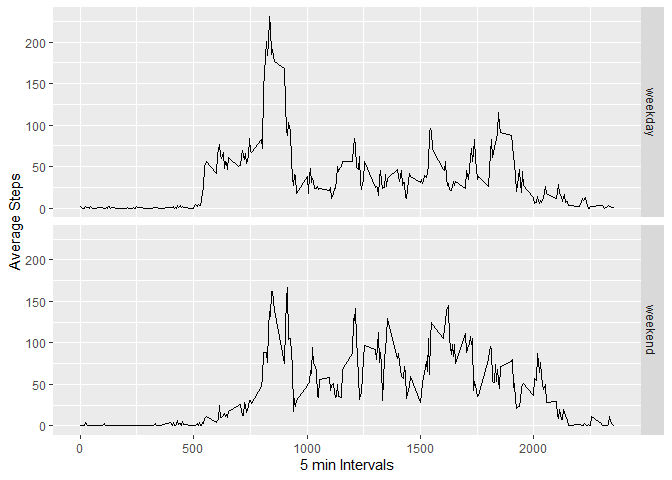

This assignment makes use of data from a personal activity monitoring device. This device collects data at 5 minute intervals through out the day. The data consists of two months of data from an anonymous individual collected during the months of October and November, 2012 and include the number of steps taken in 5 minute intervals each day.    

## Loading and preprocessing the data

This first batch of code reads the data, removes any NA values for now, and loads in packages used later.


```r
library(tidyr)
library(dplyr)
```

```
## 
## Attaching package: 'dplyr'
```

```
## The following objects are masked from 'package:stats':
## 
##     filter, lag
```

```
## The following objects are masked from 'package:base':
## 
##     intersect, setdiff, setequal, union
```

```r
data <- read.csv("activity.csv")

sorted <- data %>% filter(!is.na(steps)) 
```


## What is mean total number of steps taken per day?


```r
library(ggplot2)

q1 <- aggregate(sorted$steps,by=list(date=sorted$date),FUN=sum)

q1 <- q1 %>% mutate(date=as.Date(date,format = "%Y-%m-%d")) 

hist(q1$x,main = "Histogram of Total Steps per Day",xlab = "Number of Steps")
```

<!-- -->


```r
mean = mean(q1$x)
median=median(q1$x)
```

The mean total number of steps taken per day is 1.0766189\times 10^{4} and the median is 10765.

## What is the average daily activity pattern?

Below is a line plot of the 5 minute interval and the average number of steps taken, averaged across all days.


```r
q2 <- aggregate(sorted$steps,by=list(interval=sorted$interval),FUN=mean)

with(q2,plot(as.numeric(as.character(interval)),as.numeric(as.character(x)),type="l",xlab = "5 Min Intervals",ylab = "Average Steps take Across all Days",main = "Average Number of Steps at Each Interval"))
```

<!-- -->


```r
index = which.max(q2$x)
max = q2$interval[index]
```

The 5-minute interval that contains the maximum number of steps is 835.

## Imputing missing values


```r
dat2 <- data

for(x in c(1:length(dat2$steps))){
  if(is.na(dat2$steps[x])){
    intv <- dat2$interval[x]
    dat2$steps[x] <- q2$x[which(q2$interval==intv)]
  }
  
}

q3 <- aggregate(dat2$steps,by=list(date=dat2$date),FUN=sum)

hist(q3$x,main = "Histogram of Total Steps per Day",xlab = "Number of Steps")
```

<!-- -->


```r
num  <- sum(is.na(data$steps))
mean2 <- mean(q3$x)
median2 <- median(q3$x)
```
The number of missing values is 2304. After imputing NA values with the average of the 5 minute interval across all the days, the new mean is 1.0766189\times 10^{4} and the new median is 1.0766189\times 10^{4}. This is compared to the previous mean of 1.0766189\times 10^{4} and previous median of 10765. Imputing the missing values did not have a very large impact.


## Are there differences in activity patterns between weekdays and weekends?


```r
q4 <- dat2 %>% mutate(weekend=weekdays(as.Date(date)))

q4$weekend[which(q4$weekend %in% c("Monday","Tuesday","Wednesday","Thursday","Friday"))] <- "weekday"
q4$weekend[which(q4$weekend %in% c("Saturday","Sunday"))] <- "weekend"

dat4 <- aggregate(q4$steps,by=list(interval=q4$interval,Days=q4$weekend),FUN=mean)


par(mfrow=c(2,1),mar=c(4,4,2,1))

qplot(interval,x,data=dat4,facets = Days~.,geom = "line")+labs(y="Average Steps",x="5 min Intervals")
```

<!-- -->
